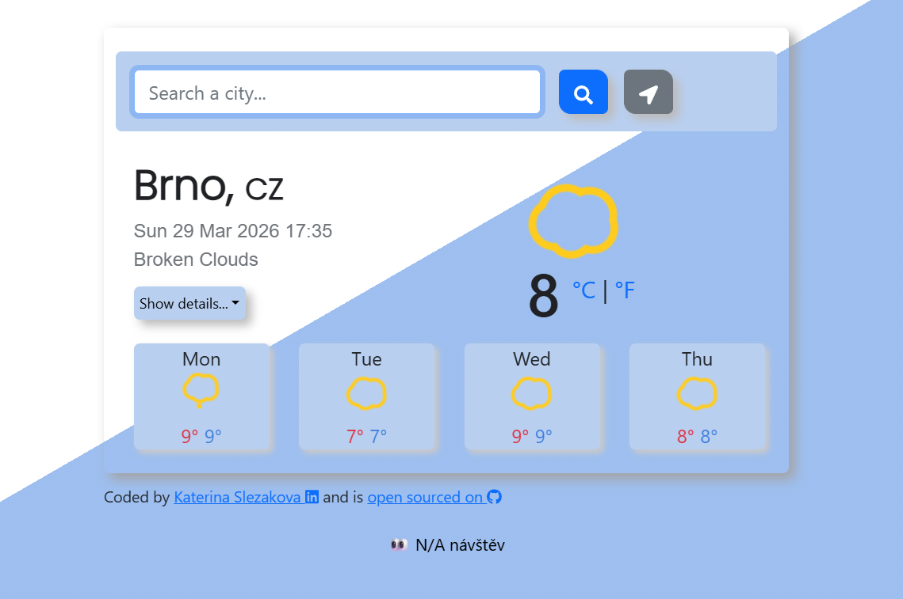

# 🌤️ Weather App
*Web application that displays current weather and a multi-day forecast for any city in the world.*



## 🔗 Demo
(https://weather-app-project-2022.netlify.app/)


## ✨ Features

- 🔍 Search for any city
- 🌡️ Display current temperature
- 📅 Multi-day weather forecast
- 🌍 Geolocation support (detect user's location)
- 👀 Visitor counter

---

## 🛠️ Technologies Used

- React
- JavaScript (ES6+)
- Axios
- CSS / Bootstrap
- OpenWeather API

---

## ⚙️ Installation & Setup

1. Clone the repository:

```bash
git clone https://github.com/your-username/weather-app.git